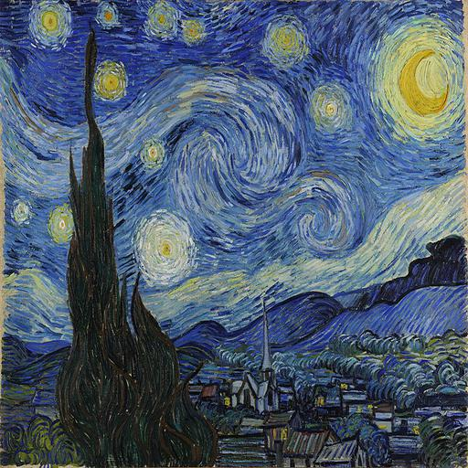
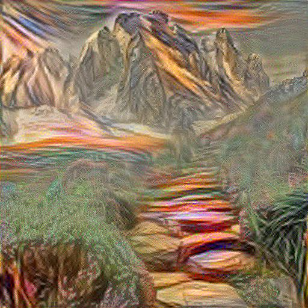
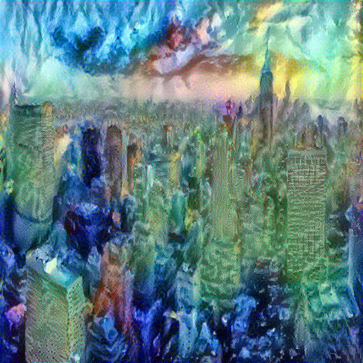

# Neural Style Transfer

Artistic style transfer is a very cool project to work on. Besides creating beautiful artistic images one could understand how images are transformed through convolutional layers which are trained on object recognition. They develop a
representation of the image that makes object information increasingly explicit along the processing hierarchy. Therefore, along the processing hierarchy of the network, the input image
is transformed into representations that increasingly care about the actual content of the image compared to its detailed pixel values. (Gatys et al)

Therefore the higher layers in the network are chosen for content representation of an Image. In contrast style or texture is captured in multiple layers. Style reprsentation of an Image is obtained by computing the correlations between feature maps from multiple lower to higer level layers feature maps.

This work is based on the very first paper on Style Transfer Algorithm from Gatys et al [A Neural Algorithm of Artistic Style](https://arxiv.org/abs/1508.06576)

This project is implemented in python 3.6 using tensorflow 1.13.1  with eager execution

# Architecture

VGG-19 image classification network pretrained on Imagenet dataset is used for this project.

Gatys et al proposed an image optimization technique to perform style transfer between content image and style image.A random noise image is initialized and passed through pretrained vgg-19 network along with style and content images.

Style loss is computed between corresponding style layers of style image and initialized noise image and content loss between corresponding content layers of content image and initialized noise image.Backpropagation is performed optimizing only the initialized noise image fixing all the weights of the network.

Column E shows VGG-19 architecture

Content_Layers = ['block4_conv2']   (Content Representation)

Style_Layers = ['block1_conv1', 'block2_conv1', 'block3_conv1', 'block4_conv1', 'block5_conv1']  (Style Representation)
                       
# Data and Preprocessing

Sample data for style transfer can be found in the data/ folder (Content and Style Images)

Preprocessing of both content and style images is done before passing to the VGG-19 pretrained network

1. Resizing of images to size (512, 512, 3), although the VGG-19 is trained on (244, 244, 3) sized images we are not including the top_layer(FC layer) so we could relax input dimension to perform style transfer on better resolution.
   So the output images are also produced with (512, 512, 3) size

2. Channel wise mean subtraction from the input image before passing to VGG-19 network.
   VGG_MEAN for BGR channels [103.939, 116.779, 123.68]

# Usage

To perform style transfer you have to provide content and style image paths and run the following command

`python neural_style_transfer.py --content_path <content_img_path> --style_path <style_img_path>`

Eg: `python neural_style_transfer.py --content_path data/content_8.jpg --style_path data/style_10.jpg`

# Results

The image optimization loop is run for 1000 iterations on NVIDIA K80 GPU which took around 3-5 minutes for each content and style image pair to obtain these beautiful artistic images.
## Result1

| Content Image | Style Image |
| --- | ---|
||  |

 Output at different iterations:

| content_img | iteration_100 | iteration_400 | iteration_1000 |
| :---: | :---: | :---: | :---:|
|||||

 Final_Image:
 
| Original Image | Style Transfered Image|
|---|---|
|||

## Result2

| Content Image | Style Image |
| --- | ---|
||  |

 Output at different iterations:

| content_img | iteration_100 | iteration_400 | iteration_1000 |
| :---: | :---: | :---: | :---:|
|||||

 Final_Image:
 
|Original Image | Style Transfered Image|
|---|---|
|||

## Result3

| Content Image | Style Image |
| --- | ---|
||  |

 Output at different iterations:

| content_img | iteration_100 | iteration_400 | iteration_1000 |
| :---: | :---: | :---: | :---:|
|||||

 Final_Image:

|Original Image | Style Transfered Image|
|---|---|
|||
